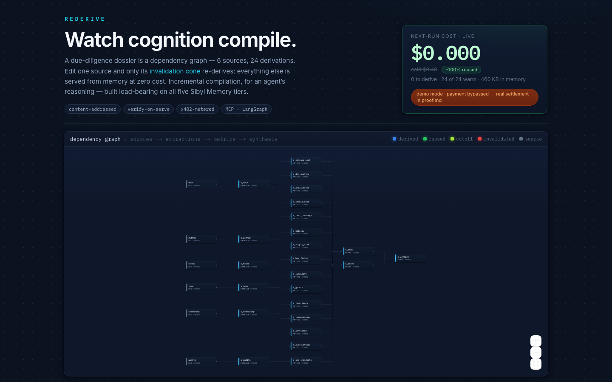

<div align="center">


### Incremental compilation for cognition

Agent-consumable due-diligence memory that re-derives **only what changed**.
Built load-bearing on all five [Sibyl Memory](https://sibyllabs.org) tiers, metered with **x402 on Base**.

**[▶ Live app](https://rederive-five.vercel.app)** · **[Operator console](https://rederive-five.vercel.app/console)** · **[API](https://rederive-api.onrender.com/health)** · **[Base Sepolia settlements](https://sepolia.basescan.org/address/0xc211C942946011859ca634F22400d80570ED12A5)**



</div>

---

## What it is

A crypto-project due-diligence dossier is a graph: 6 raw sources → 6 extractions → 15 metrics → 3 synthesis conclusions (24 derivations). Recomputing the whole thing every time a single source changes is wasteful — most of the graph didn't move.

Rederive treats cognition like a **build system**. Each derivation is content-addressed by its inputs. Edit one source and only the **invalidation cone** downstream of it re-derives; everything else is served straight from memory at zero cost. It's Bazel/Vercel-style incremental compilation, but for an agent's reasoning.

The paying consumer is a **machine** — another agent calls the metered `/answer` endpoint (x402, dynamic price = the live quote) or pulls the memory over **MCP** / **LangGraph**. The web app is the human window into it, in two pages: a **landing** that explains the model and shows the live graph, and an **operator console** (`/console`) with a two-step flow — edit a source, then re-run — to watch the invalidation cone light up and the price drop from cold to warm.

## Memory is load-bearing (the deletion test)

Disable the memory layer and the core function *fails* — that's the point, and it's provable:

```bash
# warm: the 24-node dossier is in memory, re-running costs nothing
curl -s https://rederive-api.onrender.com/quote        # → {"derived_count": 0, ...}

# amnesia: rename memory.db out — the intelligence vanishes, only sources remain
curl -s -X POST https://rederive-api.onrender.com/amnesia -H "x-admin-token: <token>"
curl -s https://rederive-api.onrender.com/quote        # → full cold price again
```

Every derivation, price, and provenance record lives in Sibyl Memory. Take it away and Rederive can only see raw text — no dossier, no incremental reuse, no verified conclusions.

### Where memory is read and written (all in [`api/rederive/engine.py`](./api/rederive/engine.py))

| Sibyl tier | Role in Rederive | Call site |
|-----------|------------------|-----------|
| **WARM** (entity) | current derivations + sources | `set_entity` / `get_entity` — `engine.py:122,126,154` |
| **COLD** (journal) | provenance: every derive is an event with its input hashes | `write_event` — `engine.py:121,157` |
| **REFERENCE** (doctrine) | pricing + invalidation policy the engine *consults* (edit doctrine → price changes, no code change) | `set_reference` / `get_reference` — `engine.py:304,308,310` |
| **ARCHIVE** | superseded/invalidated derivations kept for the time-machine | `archive_entity` — `engine.py:151,241` |
| **HOT** (state) | live run cursor, survives restart | `set_state` / `get_state` — `engine.py` (`set_cursor`) |
| **FTS5 recall** | keyword search across all tiers (the metered memory market) | `search` — `engine.py` (`recall`) |
| Multi-tenant commons | N analyst tenants on one SQLite file, cross-tenant attribution | [`api/rederive/commons.py`](./api/rederive/commons.py) |

`MemoryClient.local(...)` is created once at `engine.py:53`.

## Live proof

- **Warm boot** — the deployed free-tier instance re-hydrates a baked seed on every cold start, so the live URL is *always* warm: `GET /state` → 24 nodes, `derived_count: 0`.
- **Incremental recompilation** — `POST /edit` a source → only its transitive cone re-derives. Editing `token` invalidates exactly `{x_token, m_supply_risk, m_utility, m_liquidity, s_risk, s_score, s_verdict}` — 7 nodes, ~$0.14, the other 17 reused.
- **x402 on Base Sepolia** — real gasless USDC settlements (EIP-3009), verifiable on-chain:
  - settle (cold) `0x11ae4043db913b8bd9801aed2b1ff8efd840ded8142d8e38079578aacf163ccb`
  - settle (warm) `0x10759f3cc8ab2ee374fdebb1fca52a79f689632d8ad03876bdb0edcf03f27d41`
  - receipt anchor (NN-8) `0x926067592ee8873d4ec6b254f465849b9c2fb89b6041187586a0237c3f4a345d`
  - recall settle `0x5ed48622c69f72bde3418fa1e22f028287cd23d340c26a9cc00926dbf19673ab`

  Recompute the anchor hash yourself: `python api/scripts/verify_claims.py` (exit 0, NN-8 match).

## Architecture

```
6 sources ──▶ 6 extractions ──▶ 15 metrics ──▶ 3 synthesis  = 24 derivations
   (WARM)        (WARM)            (WARM)         (WARM)
      │             │                │              │
      └──── COLD journal (provenance) ┘         REFERENCE (pricing doctrine)
                         │
              content-addressed keys → edit a source, only its cone re-derives
```

- **Engine** — [`api/rederive/engine.py`](./api/rederive/engine.py): the derive/quote/verify core (incremental cone, early cutoff, verify-on-serve).
- **Pipeline** — [`api/rederive/pipeline.py`](./api/rederive/pipeline.py): the 24-node dossier graph + LLM extractors/metrics with stable-enum rubrics.
- **Server** — [`api/rederive/server.py`](./api/rederive/server.py): FastAPI, 17 routes, x402 middleware, admin gating.
- **Deep integration** — [`commons.py`](./api/rederive/commons.py) (multi-tenant), [`anchor.py`](./api/rederive/anchor.py) (NN-8 on-chain), [`langgraph_store.py`](./api/rederive/langgraph_store.py), [`mcp_server.py`](./api/rederive/mcp_server.py).
- **UI** — [`web/`](./web): Next.js App Router, two pages — a landing ([`app/page.tsx`](./web/app/page.tsx)) and the reactflow operator console ([`app/console/page.tsx`](./web/app/console/page.tsx)) sharing one live-state hook ([`lib/useRederive.ts`](./web/lib/useRederive.ts)).

## Run it

**Nothing to set up — just open the live app.** [rederive-five.vercel.app](https://rederive-five.vercel.app) is fully configured (LLM provider, x402, warm seed). Open it, go to the [console](https://rederive-five.vercel.app/console), edit a source, and watch the cone re-derive. **No API keys, no wallet, no accounts.**

### Or run it locally — one command, no keys

```bash
./run.sh          # API on :8402, UI on :3000 — open http://localhost:3000
```

`run.sh` creates the venv, installs deps, hydrates the **baked warm seed**, and boots both servers. With **zero API keys** you get the full warm dossier, the deletion test (amnesia → restore), recall, pricing, the on-chain anchor view, and the commons — all served from memory.

The **only** thing that needs an LLM key is re-deriving an *edited* source's cone live. For that, either export one key before running, or just use the deployed app (already configured):

```bash
export DEEPSEEK_API_KEY=sk-...        # native api.deepseek.com (reachable anywhere), OR
export AGENTROUTER_API_KEY=sk-...     # Anthropic-wire /v1/messages
./run.sh
```

Tests (no keys needed): `cd api && PYTHONPATH=. ../.venv/bin/python -m pytest` — 26 passing, incl. deletion-test, cutoff-refund, verify-on-serve, and self-falsification + no-op ablation.

## Deployment

Free-tier, no paid disk. `memory.db` persistence is achieved for $0 via a **baked warm-seed** re-hydrated on every cold boot ([`api/entrypoint.sh`](./api/entrypoint.sh)) plus optional [Litestream](https://litestream.io) replication to a free object store (env-gated). API on Render (Docker), UI on Vercel.

## Prior work

Built for the Sibyl Labs Memory Hackathon. Sibyl Memory (`sibyl-memory-client`, `sibyl-memory-cli`), x402 (`x402` PyPI, Base Sepolia facilitator), FastAPI, Next.js, reactflow, and LangGraph are third-party. The Rederive engine, dossier pipeline, incremental-cone pricing, verify-on-serve, deletion-test design, multi-tenant commons, and on-chain anchoring are original to this project.

## License

MIT — see [LICENSE](./LICENSE).
