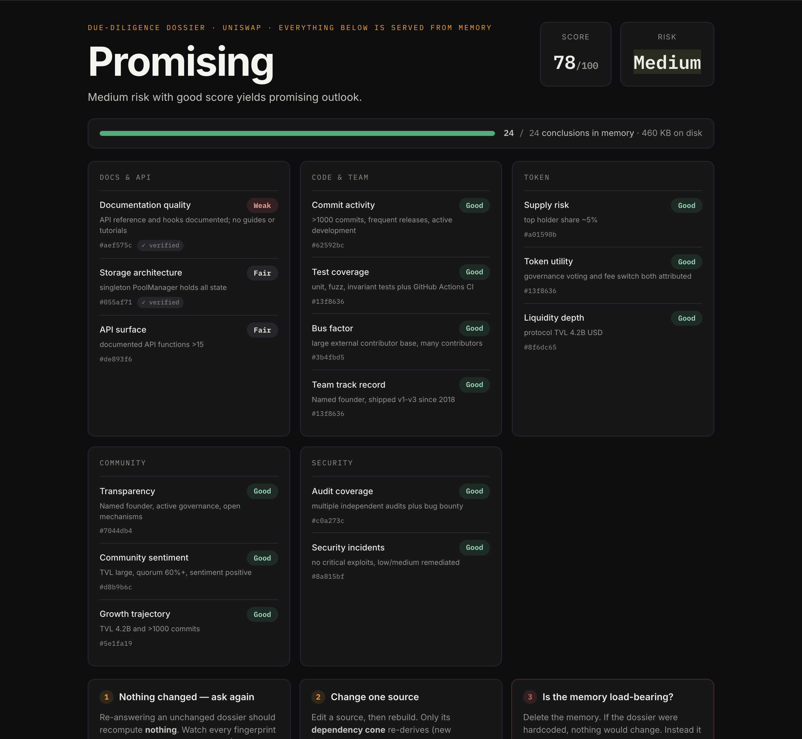

<div align="center">


### Incremental compilation for cognition

Agent-consumable due-diligence memory that re-derives **only what changed**.
Built load-bearing on all five [Sibyl Memory](https://sibyllabs.org) tiers, metered with **x402 on Base**.

**[▶ Live app](https://rederive-five.vercel.app)** · **[Operator console](https://rederive-five.vercel.app/console)** · **[API](https://rederive-api.onrender.com/health)** · **[Base Sepolia settlements](https://sepolia.basescan.org/address/0xc211C942946011859ca634F22400d80570ED12A5)**


</div>

---

## What it is

A crypto-project due-diligence dossier is a graph: **6 raw sources → 6 extractions → 15 metrics → 3 synthesis conclusions = 24 derivations**. Recomputing the whole thing every time a single source changes is wasteful, most of the graph didn't move.

Rederive treats cognition like a **build system**. Each derivation is content-addressed by a hash of its inputs. Edit one source and only the **invalidation cone** downstream of it re-derives; everything else is served straight from memory at zero cost. It's Bazel/Vercel-style incremental compilation, but for an agent's reasoning.

The paying consumer is a **machine**: another agent calls the metered `/answer` endpoint (x402, dynamic price = the live quote) or pulls the memory over **MCP** / **LangGraph**. The web app is the human window into it, in two pages: a **landing** that explains the model, and an **operator console** (`/console`) built as a **memory instrument**, everything on screen is served from memory, and three experiments let you prove it:

1. **Ask again (nothing changed)** → 0 conclusions recompute, all 24 reused, price stays **$0.000**, every content fingerprint identical.
2. **Change one source** → only its **dependency cone** re-derives with new fingerprints; the rest hold, reused free.
3. **Delete the memory** → the whole dossier collapses to "No Memory" and the memory gauge drops from 24/24 · ~460KB to **0/24 · 4KB**; Restore brings it back warm.

Each conclusion wears its content fingerprint, so reuse (same hash) and recompute (new hash) are provable by eye, not taken on faith.

<div align="center">

</div>

## The pricing model, why a re-answer costs $0.000

**Price = (number of derivations actually executed) × unit cost.** The unit cost ($0.02) is read live from the REFERENCE memory tier, so it's editable without touching code. Three states:

| State | What runs | Derivations executed | Price |
|-------|-----------|----------------------|-------|
| **Cold** (first run, empty memory) | every node computed by the LLM | 24 | **$0.48** |
| **Warm** (nothing changed) | keys match memory → serve stored values | **0** | **$0.000** |
| **Cone** (one source edited) | only the edited source's transitive cone | 7 (for `token`) | **$0.14** |

So the **$0.000** you see on the live app is the *warm* price. The dossier was derived once (paid once, real LLM calls), and re-answering **reuses** it, a memory read, not a recompute, exactly like `make` skipping a file that hasn't changed. It's not "free work"; it's "no new work." The moment you edit a source, you pay again, but only for the part that actually changed (`$0.14`, not `$0.48`).

## Reproduce every claim yourself

Every number above is checkable against the **live API**: zero setup, no keys. Copy-paste:

```bash
API=https://rederive-api.onrender.com

# ── A. WARM: a re-answer costs nothing (this is the number on the app) ──
curl -s $API/quote
# → {"total_usd": 0.0, "derived_count": 0, "reused_count": 24, ...}
```

**The deletion test, proof the memory is load-bearing.** The easy path is one click on the [live console](https://rederive-five.vercel.app/console): in experiment 3, hit **Delete memory** and watch the dossier collapse and the gauge drop to 0/24, then **Restore**. To reproduce it at the API level, run the app locally with `./run.sh` (it sets `ADMIN_TOKEN=dev`) and use that token:

```bash
# run the app locally first (keyless): ./run.sh  → API on :8402
API=http://localhost:8402
TOKEN=dev            # set by ./run.sh for the local instance

# ── B. Delete the memory → the intelligence vanishes, the cold price returns ──
curl -s -X POST $API/amnesia -H "x-admin-token: $TOKEN"
# → {"ok": true, "db_present": false}
curl -s $API/state | python3 -c "import sys,json; print('nodes:', len(json.load(sys.stdin)['nodes']))"
# → nodes: 6      (only the raw sources remain, the 24 derivations are gone)
curl -s $API/quote
# → {"total_usd": 0.48, "derived_count": 24, ...}   ← full COLD price, nothing to reuse

# ── C. Restore → warm again, bit-for-bit ──
curl -s -X POST $API/amnesia -H "x-admin-token: $TOKEN" -d '{"restore":true}'
# → {"ok": true, "db_present": true}
curl -s $API/quote
# → {"total_usd": 0.0, "derived_count": 0, ...}     ← back to WARM
```

**The cone, edit one source, only 7 of 24 re-derive.** The edit and the quote are keyless; the final re-derive (`/answer`) calls the LLM, so either export `DEEPSEEK_API_KEY` for the local run, or point `API` at the deployed instance which already has the key:

```bash
# ── D. Edit the token source → its invalidation cone lights up ──
curl -s -X POST $API/edit -H "x-admin-token: $TOKEN" \
  -d '{"source":"token","content":"Fixed 100M supply, 45% team, 3mo cliff, no tokenomics audit."}'
# → {"invalidated": ["x_token","m_supply_risk","m_utility","m_liquidity","s_risk","s_score","s_verdict"]}
#    exactly 7 nodes, the token cone
curl -s $API/quote
# → {"total_usd": 0.14, "derived_count": 7, "reused_count": 17, ...}   ← pay only for the cone
curl -s -X POST $API/answer            # re-derives the 7, returns the corrected dossier
curl -s $API/quote                     # → derived_count 0 again (warm)
```

**Verify-on-serve, recall, and the on-chain anchor** (all read-only, no token):

```bash
# ── E. verify-on-serve: re-derive a node and compare fingerprints (tamper check) ──
curl -s -X POST $API/verify -d '{"node":"s_verdict"}'
# → {"verdict": "MATCH", "stored_fp": "...", "fresh_fp": "..."}   (equal = untampered)

# ── F. FTS5 recall across all tiers ──
curl -s "$API/recall?q=liquidity"      # → 10 keyword hits across the memory

# ── G. recompute the on-chain receipt anchor hash yourself ──
python api/scripts/verify_claims.py    # exit 0, the NN-8 hash matches what's on Base Sepolia
```

> The public instance runs `DEMO_FREE=1`, so **no USDC is charged to a visitor**: the prices above are the *quoted* amounts the engine computes. Proof that real money moves when demo mode is off = the four on-chain transactions below.

## Memory is load-bearing (where every tier is used)

Take the memory away and the core function *fails* (the deletion test above). Every derivation, price, and provenance record lives in Sibyl Memory, and **all five tiers fail a delete-test (NN-6), none is decoration**:

| Sibyl tier | Role in Rederive | Call site (all in [`api/rederive/engine.py`](./api/rederive/engine.py)) |
|-----------|------------------|-----------|
| **WARM** (entity) | current derivations + sources | `set_entity` / `get_entity`: `engine.py:122,126,154` |
| **COLD** (journal) | provenance: every derive is an event with its input hashes | `write_event`: `engine.py:121,157` |
| **REFERENCE** (doctrine) | pricing + invalidation policy the engine *consults* (edit doctrine → price changes, no code change) | `set_reference` / `get_reference`: `engine.py:304,308,310` |
| **ARCHIVE** | superseded/invalidated derivations kept for the time-machine | `archive_entity`: `engine.py:151,241` |
| **HOT** (state) | live run cursor, survives restart | `set_state` / `get_state`: `engine.py` (`set_cursor`) |
| **FTS5 recall** | keyword search across all tiers (the metered memory market) | `search`: `engine.py` (`recall`) |
| Multi-tenant commons | N analyst tenants on one SQLite file, cross-tenant attribution | [`api/rederive/commons.py`](./api/rederive/commons.py) |

`MemoryClient.local(...)` is created once at `engine.py:53`.

## What the dossier contains (full scope)

The 24 derivations, in four stages, each node reads only the stage above it (metrics read extractions, synthesis reads metrics), so an edit's effect is a clean cone:

| Stage | Count | Nodes |
|-------|-------|-------|
| **Sources** (raw, not priced) | 6 | `docs`, `github`, `token`, `team`, `community`, `audits` |
| **Extractions** (structured facts per source) | 6 | `x_docs`, `x_github`, `x_token`, `x_team`, `x_community`, `x_audits` |
| **Metrics** (scored signals, stable-enum rubrics) | 15 | `m_doc_quality`, `m_storage_arch`, `m_api_surface`, `m_commit_rate`, `m_test_coverage`, `m_bus_factor`, `m_supply_risk`, `m_utility`, `m_liquidity`, `m_team_track`, `m_growth`, `m_transparency`, `m_sentiment`, `m_audit_status`, `m_sec_incidents` |
| **Synthesis** (the verdict) | 3 | `s_risk` (risk level + top risks), `s_score` (0–100 band), `s_verdict` (promising / mixed / avoid) |

Editing `token` invalidates `x_token` → the three token-fed metrics (`m_supply_risk`, `m_utility`, `m_liquidity`) → all three synthesis nodes = **7**. Editing `docs` invalidates a different cone. The rest stays warm.

## x402 on Base Sepolia (real settlements, on-chain)

Real gasless USDC settlements (EIP-3009), each resolvable on Basescan:

- settle (cold) `0x11ae4043db913b8bd9801aed2b1ff8efd840ded8142d8e38079578aacf163ccb`
- settle (warm) `0x10759f3cc8ab2ee374fdebb1fca52a79f689632d8ad03876bdb0edcf03f27d41`
- receipt anchor (NN-8) `0x926067592ee8873d4ec6b254f465849b9c2fb89b6041187586a0237c3f4a345d`
- recall settle `0x5ed48622c69f72bde3418fa1e22f028287cd23d340c26a9cc00926dbf19673ab`

## API reference

17 routes ([`api/rederive/server.py`](./api/rederive/server.py)). The metered ones are x402-gated unless `DEMO_FREE=1`; mutations require `x-admin-token`.

| Method | Endpoint | Description | Auth |
|--------|----------|-------------|------|
| GET | `/state` | full graph + verdicts + embedded quote (what the UI polls) | public |
| GET | `/quote` | dry-run price of the next `/answer` (derived vs reused) | public |
| POST | `/answer` | run the dossier; re-derive stale nodes, reuse the rest | x402 (metered) |
| POST | `/edit` | re-ingest a source with new content → returns the invalidated cone | admin |
| POST | `/verify` | re-derive a node, compare fingerprints (tamper check) | public |
| POST | `/amnesia` | delete the memory (`{restore:true}` to bring it back), the deletion test | admin |
| POST | `/reset` | clear all derivations (sources stay) | admin |
| GET | `/recall` | FTS5 keyword search across every tier | x402 (metered) |
| GET/POST | `/doctrine` | read / edit the REFERENCE pricing policy (edit → price changes live) | admin (POST) |
| POST | `/timemachine` | recover a superseded derivation from ARCHIVE | admin |
| POST | `/anchor` | hash-anchor a receipt in a Base tx (NN-8) | admin |
| GET/POST | `/commons` | multi-tenant co-authored run + ledger | admin (run) |

## Architecture

```
6 sources ──▶ 6 extractions ──▶ 15 metrics ──▶ 3 synthesis  = 24 derivations
   (WARM)        (WARM)            (WARM)         (WARM)
      │             │                │              │
      └──── COLD journal (provenance) ┘         REFERENCE (pricing doctrine)
                         │
              content-addressed keys → edit a source, only its cone re-derives
```

- **Engine**: [`api/rederive/engine.py`](./api/rederive/engine.py): the derive/quote/verify core (incremental cone, early cutoff, verify-on-serve).
- **Pipeline**: [`api/rederive/pipeline.py`](./api/rederive/pipeline.py): the 24-node dossier graph + LLM extractors/metrics with stable-enum rubrics.
- **Server**: [`api/rederive/server.py`](./api/rederive/server.py): FastAPI, 17 routes, x402 middleware, admin gating.
- **Deep integration**: [`commons.py`](./api/rederive/commons.py) (multi-tenant), [`anchor.py`](./api/rederive/anchor.py) (NN-8 on-chain), [`langgraph_store.py`](./api/rederive/langgraph_store.py), [`mcp_server.py`](./api/rederive/mcp_server.py).
- **UI**: [`web/`](./web): Next.js App Router, two pages, a landing ([`app/page.tsx`](./web/app/page.tsx)) and the reactflow operator console ([`app/console/page.tsx`](./web/app/console/page.tsx)) sharing one live-state hook ([`lib/useRederive.ts`](./web/lib/useRederive.ts)).

## Run it

**Nothing to set up, just open the live app.** [rederive-five.vercel.app](https://rederive-five.vercel.app) is fully configured (LLM provider, x402, warm seed). Open it, go to the [console](https://rederive-five.vercel.app/console), edit a source, and watch the cone re-derive. **No API keys, no wallet, no accounts.**

### Or run it locally, one command, no keys

```bash
git clone https://github.com/dmustapha/rederive
cd rederive
./run.sh          # API on :8402, UI on :3000, open http://localhost:3000
```

`run.sh` creates the venv, installs deps, hydrates the **baked warm seed**, and boots both servers. With **zero API keys** you get the full warm dossier, the deletion test (amnesia → restore), recall, pricing, the on-chain anchor view, and the commons, all served from memory. (Verified end-to-end: the UI comes up warm at `$0.000` against the local API.)

The **only** thing that needs an LLM key is re-deriving an *edited* source's cone live (scenario **D** above). For that, either export one key before running, or just use the deployed app (already configured):

```bash
export DEEPSEEK_API_KEY=sk-...        # native api.deepseek.com (reachable anywhere), OR
export AGENTROUTER_API_KEY=sk-...     # Anthropic-wire /v1/messages
./run.sh
```

Tests (no keys needed): `cd api && PYTHONPATH=. ../.venv/bin/python -m pytest`: **26 passing**, incl. deletion-test, cutoff-refund, verify-on-serve, and self-falsification + no-op ablation.

## Deployment

API on Render (Docker), UI on Vercel. State hydrates from a committed warm seed on every boot ([`api/entrypoint.sh`](./api/entrypoint.sh)), so even a cold start comes up fully populated.

## Prior work

Built for the Sibyl Labs Memory Hackathon. Sibyl Memory (`sibyl-memory-client`, `sibyl-memory-cli`), x402 (`x402` PyPI, Base Sepolia facilitator), FastAPI, Next.js, reactflow, and LangGraph are third-party. The Rederive engine, dossier pipeline, incremental-cone pricing, verify-on-serve, deletion-test design, multi-tenant commons, and on-chain anchoring are original to this project.

## License

MIT, see [LICENSE](./LICENSE).
